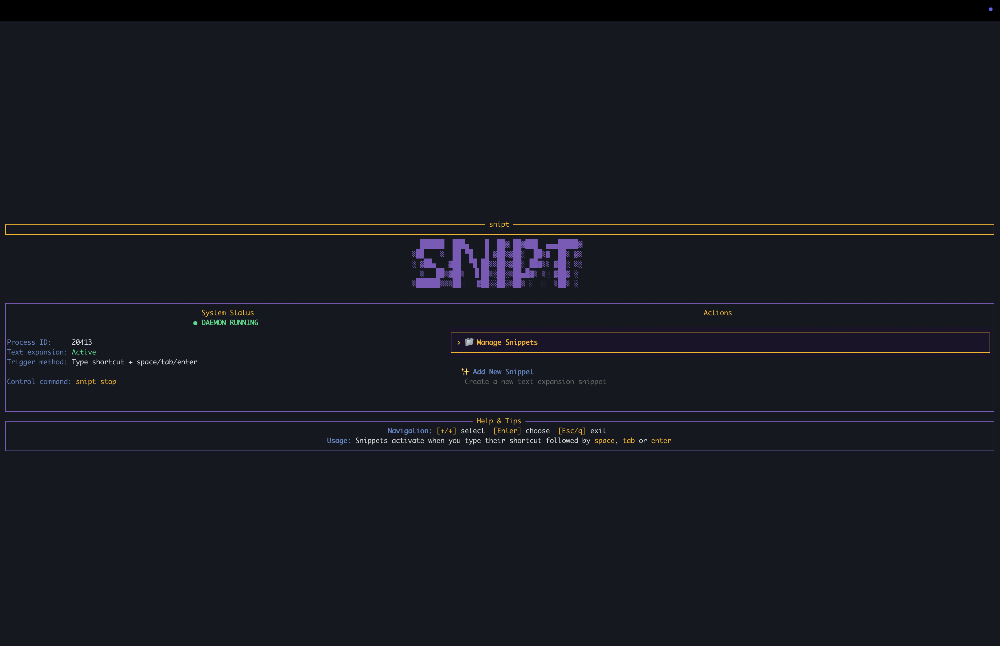

<div align="center">

# Snipt

[](https://www.rust-lang.org/)
[]()

</div>

---
## 🚀 Overview

snipt is a powerful text snippet expansion tool that boosts your productivity by replacing short text shortcuts with longer content. Just type a prefix (like `:`) followed by your shortcut, and snipt automatically expands it into your predefined text.

## ✨ Key Features

- **Custom Text Snippets**: Define shortcut aliases for frequently used text
- **System-Wide Expansion**: Works in any application where you can type
- **Modern TUI**: Beautiful terminal interface for managing snippets
- **Background Daemon**: Silent monitoring of keyboard input for expansion
- **Cross-Platform**: Works seamlessly on Linux, macOS, and Windows
- **Clipboard Integration**: Quickly copy expansions to clipboard
- **Script Execution**: Execute shell scripts and commands with `!` prefix
- **Parameterized Snippets**: Create dynamic snippets with parameters
- **Text Transformations**: Transform text with case conversion, formatting, and more
- **URL Commands**: Execute web requests and process responses
- **Code Snippets**: Store and expand code snippets with syntax highlighting
- **Date and Time**: Insert formatted dates and times
- **File Operations**: Create projects and perform file operations
- **System Information**: Get system stats and information
- **Network Tools**: Make HTTP requests and process responses
- **CSV Processing**: Convert CSV to markdown tables and other formats

## 📦 Installation

### From Source

```bash
# 1. Install Rust if needed (https://rustup.rs/)
curl --proto '=https' --tlsv1.2 -sSf https://sh.rustup.rs | sh

# 2. Clone and build snipt
git clone https://github.com/bahdotsh/snipt.git
cd snipt
cargo build --release

# 3. Install the binary (optional)
cargo install --path .
```

## 🎮 Usage

### Starting snipt

```bash
# Launch interactive UI
snipt

# Start the daemon (required for expansion)
snipt start
```

### Managing Snippets

```bash
# Add a snippet
snipt add --shortcut hello --snippet "Hello, world!"

# Add interactively
snipt new

# View and manage all snippets
snipt list

# Remove a snippet
snipt delete --shortcut hello

# Update existing snippet
snipt update --shortcut hello --snippet "Hello there, world!"
```

### Using Snippets

Snipt supports two types of triggers:

1. **Colon Trigger (`:`)**: For simple text expansion
   ```
   :hello  # Expands to "Hello, world!"
   ```

2. **Exclamation Trigger (`!`)**: For executing scripts and transformations
   ```
   !now    # Inserts current date and time
   !uppercase(hello)  # Transforms to "HELLO"
   ```

### Parameterized Snippets

Create dynamic snippets with parameters:

```bash
# Add a parameterized snippet
snipt add --shortcut "greet(name)" --snippet "Hello, ${name}!"

# Usage
!greet(John)  # Expands to "Hello, John!"
```

### Script Execution

Execute shell scripts and commands:

```bash
# Add a script snippet
snipt add --shortcut "sys-info" --snippet "#!/bin/bash\necho '=== System Information ==='\necho 'Hostname: $(hostname)'"

# Usage
!sys-info  # Executes the script and inserts output
```

### Text Transformations

Transform text with built-in functions:

```bash
# Case conversion
!uppercase(hello)  # HELLO
!lowercase(HELLO)  # hello
!titlecase(hello world)  # Hello World

# Formatting
!indent(2,Hello\nWorld)  # Adds 2-space indentation
!csv2md(Name,Age,John,30)  # Converts CSV to markdown table
```

### Monitoring & Control

```bash
# Check daemon status
snipt status

# Stop the daemon
snipt stop
```

## 💡 How Expansion Works

Once the daemon is running, type your prefix followed by a shortcut anywhere on your system:

```
:hello
```

This instantly expands to "Hello, world!" (or your custom text).

## 🖥️ Terminal User Interface

<div align="center">



</div>

Launch the beautiful terminal UI with either `snipt` or `snipt list`.

### Navigation

| Key         | Action                     |
|-------------|----------------------------|
| ↑/↓         | Navigate through snippets  |
| Tab         | Switch between tabs        |
| Enter       | Copy to clipboard          |
| /           | Search snippets            |
| Ctrl+D      | Delete selected snippet    |
| Esc/q       | Exit                       |

## ⚙️ Configuration

snipt stores your data in `~/.snipt/`:

- `snipt.json`: Your snippet database
- `snipt-daemon.pid`: Process ID of running daemon

## 🧩 Architecture

snipt consists of several components:

- **Core Library**: Handles snippet management, persistence, and expansion
- **Daemon**: Background process that listens for keyboard events
- **CLI**: Command-line interface for controlling snipt
- **TUI**: Terminal user interface for snippet management
- **Server**: HTTP API for potential GUI clients
- **Execution Engine**: Handles script execution and text transformations
- **Storage**: Manages snippet persistence and configuration
- **Keyboard**: Handles system-wide keyboard monitoring
- **Clipboard**: Manages clipboard operations

## 🔨 Requirements

- Rust 1.56+
- Core dependencies: rdev, clap, serde, crossterm, ratatui, enigo, arboard

### System Dependencies

#### Linux (Ubuntu/Debian)
```bash
sudo apt-get update
sudo apt-get install -y libx11-dev libxi-dev pkg-config
```

#### Linux (Fedora/RHEL)
```bash
sudo dnf install libX11-devel libXi-devel pkg-config
```

#### Linux (Arch Linux)
```bash
sudo pacman -S libx11 libxi pkg-config
```

## 🤝 Contributing

Contributions are welcome! Please feel free to:

1. Fork the repository
2. Create a feature branch
3. Submit a pull request

## 📜 License

MIT

---

<div align="center">
  <p>Built with ❤️ using Rust</p>
</div>
